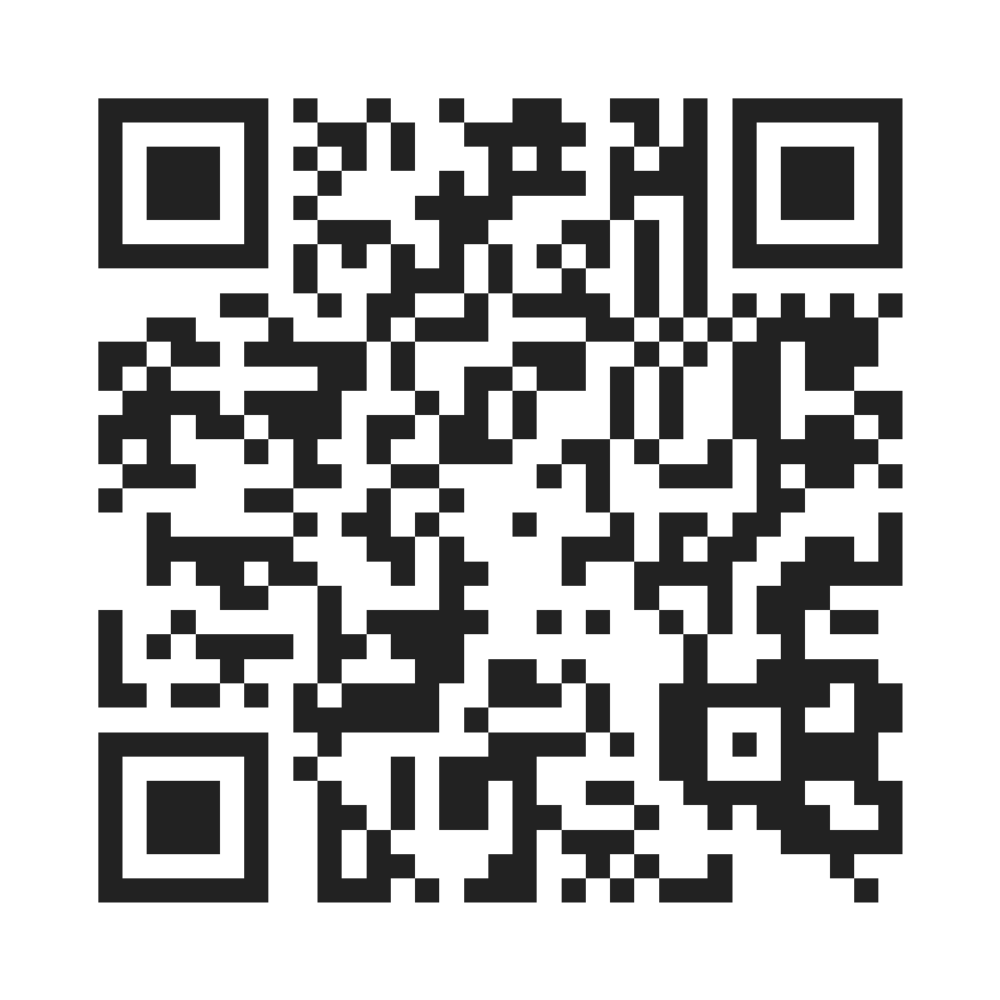
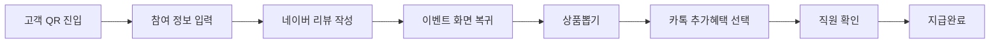
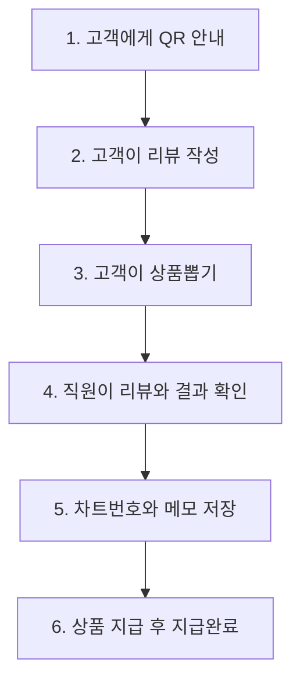
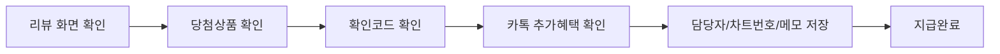
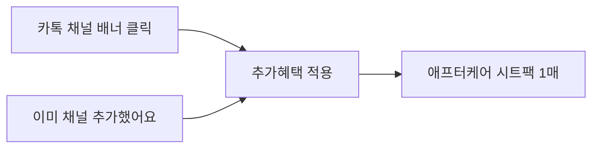
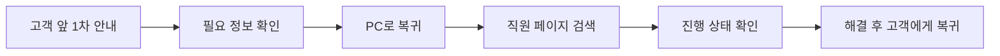

# 페이스필터 천호점 리뷰 이벤트 직원 가이드

> 고객은 QR로 직접 진행하고, 직원은 리뷰 화면과 결과 화면을 확인한 뒤 지급완료만 처리합니다.



| 구분 | 링크 |
| --- | --- |
| 고객용 QR 페이지 | https://project-q5ykg.vercel.app/ |
| 직원 페이지 | https://project-q5ykg.vercel.app/?mode=staff |
| 관리자 페이지 | https://project-q5ykg.vercel.app/?mode=admin |

## 한눈에 보는 흐름



## 직원이 확인할 2가지

| 확인 | 화면 | 이유 |
| --- | --- | --- |
| 1 | 네이버 포토리뷰 작성 화면 | 실제 리뷰 작성 여부 확인 |
| 2 | 이벤트 결과 화면 | 당첨상품, 확인코드, 추가혜택 확인 |

결과 화면만 보고 지급하지 않습니다.  
리뷰 화면과 결과 화면을 함께 확인한 뒤 지급완료를 눌러주세요.

## 현장 기본 순서



| 단계 | 직원 행동 | 체크포인트 |
| --- | --- | --- |
| QR 안내 | 고객에게 고객용 QR만 안내 | 직원 페이지 링크는 고객에게 공유하지 않음 |
| 리뷰 작성 | 네이버 리뷰 버튼을 누르도록 안내 | 리뷰 후 이벤트 화면으로 돌아와야 함 |
| 상품뽑기 | 고객이 직접 물방울 선택 | 결과는 새로고침해도 바뀌지 않음 |
| 직원 확인 | 리뷰 화면과 결과 화면 확인 | 상품명, 확인코드, 추가혜택 확인 |
| 지급완료 | 담당자, 차트번호, 메모 저장 후 지급완료 | 지급완료 후 고객 세션 종료 |

## 상태 배지별 대응

| 상태 | 의미 | 직원 대응 |
| --- | --- | --- |
| `등록` | 참여 정보만 입력된 상태 | 리뷰 작성 버튼부터 안내 |
| `리뷰 작성/복귀 전` | 네이버 리뷰 화면으로 나간 뒤 이벤트 화면으로 아직 복귀하지 않음 | QR 재진입 후 같은 정보 입력 안내 |
| `뽑기 가능` | 리뷰 링크 확인 후 뽑기 가능 상태 | 일반 뽑기 버튼 먼저 사용 |
| `직원 확인 대기` | 뽑기 완료, 지급 전 상태 | 리뷰 화면과 결과 화면 확인 후 지급 |
| `지급완료` | 상품 지급 처리 완료 | 추가 대응 없음 |

## 지급완료 전 체크리스트



- 네이버 포토리뷰 작성 화면을 확인합니다.
- 이벤트 결과 화면의 상품명과 확인코드를 확인합니다.
- 카톡 채널 추가혜택이 적용됐는지 확인합니다.
- 담당자 이름을 입력합니다. 예: `홍길동`
- 고객 차트번호를 입력합니다. 예: `6321`
- 지급 특이사항이 있으면 지급 메모에 남깁니다.
- 실제 상품 지급 후 `지급완료`를 누릅니다.

## 대신뽑기 기준

대신뽑기는 예외 처리입니다.  
고객이 정상 진행 가능하면 고객 화면에서 직접 뽑게 해주세요.

| 사용 가능 | 사용 금지 |
| --- | --- |
| 고객이 리뷰를 작성했지만 이벤트 화면 복귀가 계속 안 됨 | 리뷰 작성 여부를 확인하지 못함 |
| 직원이 리뷰 화면을 직접 확인함 | 일반 뽑기 버튼이 정상적으로 보임 |
| 지급 메모에 사유를 남길 수 있음 | 고객이 단순히 진행을 귀찮아함 |

대신뽑기 메모 예시:

```text
네이버 리뷰 작성 화면 확인. 고객 휴대폰에서 이벤트 화면 복귀 실패로 대신뽑기 진행.
```

## 카톡 채널 추가 혜택



| 화면 표시 | 의미 |
| --- | --- |
| `추가혜택: 애프터케어 시트팩 1매` | 고객이 카톡 혜택 버튼을 누른 상태 |
| `추가혜택: 미신청` | 고객이 카톡 혜택 버튼을 누르지 않은 상태 |

실제 카카오톡 친구 추가 여부를 시스템이 자동 검증하는 구조는 아닙니다.  
운영 기준은 “고객이 이벤트 화면에서 카톡 혜택 버튼을 눌렀는지”입니다.

## PC 앞이 아닐 때 응대 흐름

직원이 고객을 응대하는 위치가 항상 직원 PC 앞이 아닐 수 있습니다.  
이 경우 고객 앞에서 바로 해결하려고 오래 붙잡지 말고, 아래 순서로 처리합니다.



| 위치 | 직원 행동 | 확인할 정보 |
| --- | --- | --- |
| 고객 앞 | QR 재진입과 동일 정보 입력을 먼저 안내 | 이름, 휴대폰 뒤 4자리, 네이버 ID/닉네임 |
| PC 복귀 | 직원 페이지에서 고객 검색 후 선택 | 고객명, 번호, 네이버 닉네임 |
| PC 확인 | 진행 위치 확인 | 등록, 복귀 전, 뽑기 가능, 직원 확인 대기 |
| 고객 복귀 | 해결 결과 안내 후 지급 처리 | 리뷰 화면, 결과 화면, 차트번호 |

PC까지 돌아가서 확인해야 하는 대표 상황:

- 고객이 리뷰 작성 후 이벤트 화면을 못 찾는 경우
- 고객 화면에서 뽑기 버튼이 안 열린다고 하는 경우
- 이미 참여자라고 나오는데 고객이 진행 중이었다고 하는 경우
- 대신뽑기가 필요한 경우
- 지급완료, 차트번호, 지급 특이사항 메모를 남겨야 하는 경우

고객 앞에서 받을 정보:

```text
성함 / 휴대폰 뒤 4자리 / 네이버 ID 또는 닉네임
가능하면 결과 화면 확인코드 또는 당첨상품
```

## 고객이 막혔을 때

### 1. 네이버 리뷰를 쓰고 이벤트 화면을 못 찾는 경우

고객에게 QR을 다시 찍게 합니다.  
그 다음 아래 3가지를 기존과 똑같이 입력하도록 안내합니다.

| 입력값 | 주의 |
| --- | --- |
| 이름 | 실제 이름 |
| 휴대폰 뒤 4자리 | 숫자 4자리 |
| 네이버 ID/닉네임 | 처음 입력한 값과 동일해야 함 |

세 값이 모두 같아야 기존 진행 화면으로 이어집니다.

### 2. 이미 참여한 인원이라고 나오는 경우

입력값이 기존 기록과 다른지 확인합니다.

- 이름 철자
- 휴대폰 뒤 4자리
- 네이버 ID/닉네임 띄어쓰기 또는 철자

값이 다르면 기존 화면을 불러오지 못합니다.

### 3. 뽑기가 안 되는 경우

먼저 고객 화면에 일반 `상품뽑기` 버튼이 보이는지 확인합니다.

| 상황 | 대응 |
| --- | --- |
| 일반 뽑기 버튼이 보임 | 일반 뽑기 사용 |
| 리뷰 화면은 확인했지만 고객 화면 진행이 안 됨 | 메모 후 대신뽑기 |
| 리뷰 화면 확인이 안 됨 | 지급 보류 |

### 4. 카톡 혜택이 미신청으로 보이는 경우

고객이 카톡 배너 또는 `이미 채널 추가했어요` 버튼을 누르지 않은 상태입니다.  
고객이 혜택을 원하면 결과 화면의 카톡 혜택 버튼을 눌러 적용합니다.

## 직원 페이지 입력 기준

| 항목 | 입력 기준 |
| --- | --- |
| 담당자 | 실제 지급/확인 처리한 직원 이름. 예: `홍길동` |
| 고객 차트번호 | 원내 차트번호. 예: `6321` |
| 지급 메모 | 지급 특이사항, 대신뽑기 사유, 카톡 확인 등 |

담당자명은 한 번 저장하면 수정할 수 없습니다.  
잘못 저장한 경우 관리자에게 문의합니다.

## 지급 특이사항 메모 예시

특이사항이 없으면 비워도 됩니다.  
다만 아래 상황은 짧게 남겨주세요.

| 상황 | 메모 예시 |
| --- | --- |
| 고객이 화면 복귀를 못함 | `리뷰 화면 확인. 고객 화면 복귀 실패로 대신뽑기 진행.` |
| 카톡 혜택을 직원이 확인함 | `카톡 채널 추가 화면 확인.` |
| 상품 지급 시 별도 안내함 | `시술 후 사용 안내 후 지급.` |
| 차트 확인이 필요한 경우 | `차트번호 확인 후 지급 필요.` |

## 현장 원칙

| 원칙 | 내용 |
| --- | --- |
| 고객 진행 우선 | 고객이 할 수 있으면 고객 화면에서 직접 진행 |
| 직원 개입 최소화 | 리뷰 확인, 예외 처리, 지급완료만 직원이 처리 |
| 지급완료는 마지막 | 실제 상품 지급 후에만 누름 |
| 메모는 짧게 | 문제 상황만 핵심적으로 남김 |

## 짧은 안내 멘트

고객에게 안내할 때는 이렇게 말하면 됩니다.

```text
QR 찍고 성함, 휴대폰 뒤 4자리, 네이버 닉네임 입력해 주세요.
리뷰 작성 후 이벤트 화면으로 돌아오시면 상품뽑기까지 진행됩니다.
마지막에 리뷰 화면이랑 결과 화면을 같이 보여주시면 상품 지급 도와드릴게요.
```

고객이 화면을 잃어버렸을 때:

```text
괜찮습니다. QR 다시 찍고 아까 입력한 성함, 번호 뒤 4자리, 네이버 닉네임을 똑같이 입력하시면 이어서 진행됩니다.
```
